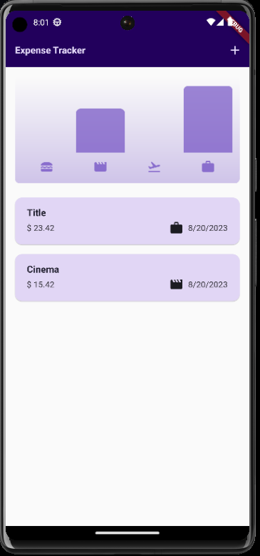
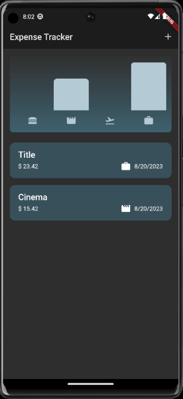
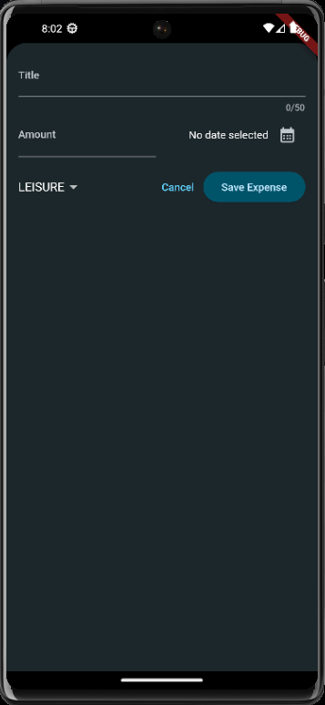
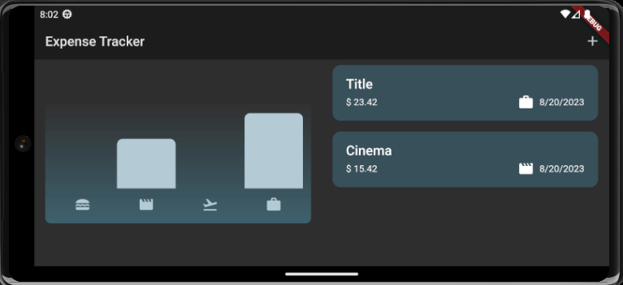

# Flutter expense tracker app

Expense tracking app. Depending on your system settings, the app runs in a light or dark theme. It includes a chart and a list of expenses. Ability to add expenses and categorize them. It is possible to remove an expense by moving it to the side. UI adapted to phone rotation and tablet view.

## Contents

- [Requirements](#requirements)
- [Install](#install)
- [Starting](#booting)
- [Sample Photos](#sample-photos)
- [Author](#author)

## Requirements

Before you start working on your project, make sure you have installed:

- [Flutter](https://flutter.dev/docs/get-started/install)

## Installation

1. Clone the repository:

```bash
git clone https://github.com/czareks/flutter-course-apps/main/expense_tracker/
```
2. Go to the project directory:
```bash
cd expense_tracker
```
3. Install dependencies:
```bash
flutter pub get
```
## Startup
1. Run the project with the command:
```bash
flutter run
```
This will launch the app on the default emulator or connected device.

## Photos of the application






## Author
Cezary Śliwiński
- GitHub: Czareks
