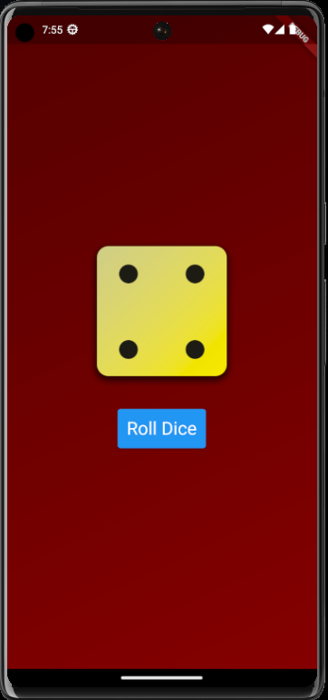

# Flutter roll dice app

Krótki opis projektu.

## Spis Treści

- [Wymagania](#wymagania)
- [Instalacja](#instalacja)
- [Uruchamianie](#uruchamianie)
- [Przykładowe Zdjęcia](#przykładowe-zdjęcia)
- [Autor](#autor)

## Wymagania

Przed rozpoczęciem pracy nad projektem, upewnij się, że masz zainstalowane:

- [Flutter](https://flutter.dev/docs/get-started/install)

## Instalacja

1. Sklonuj repozytorium:

```bash
git clone https://github.com/twoj-uzytkownik/nazwa-repozytorium.git
```
2. Przejdź do katalogu projektu:
```bash
cd nazwa-repozytorium
```
3. Zainstaluj zależności:
```bash
flutter pub get
```
## Uruchamianie
1. Uruchom projekt za pomocą komendy:
```bash
flutter run
```
To spowoduje uruchomienie aplikacji na domyślnym emulatorze lub podłączonym urządzeniu.

## Zdjęcia aplikacji



## AUtor
Cezary Śliwiński
- GitHub: czareks
