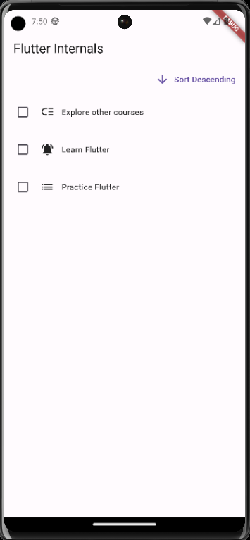
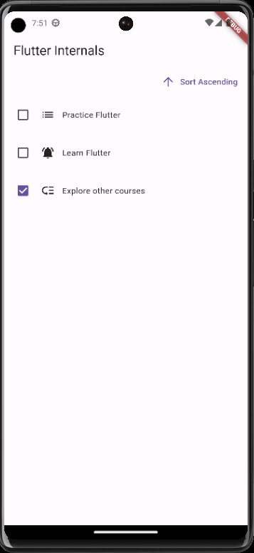

# Flutter Todo app

A small todo list app with the ability to select and sort

## Contents

- [Requirements](#requirements)
- [Install](#install)
- [Starting](#booting)
- [Sample Photos](#sample-photos)
- [Author](#author)

## Requirements

Before you start working on your project, make sure you have installed:

- [Flutter](https://flutter.dev/docs/get-started/install)

## Installation

1. Clone the repository:

```bash
git clone https://github.com/czareks/flutter-course-apps/main/todo_app/
```
2. Go to the project directory:
```bash
cd todo_app
```
3. Install dependencies:
```bash
flutter pub get
```
## Startup
1. Run the project with the command:
```bash
flutter run
```
This will launch the app on the default emulator or connected device.

## Photos of the application




## Author
Cezary Śliwiński
- GitHub: Czareks
